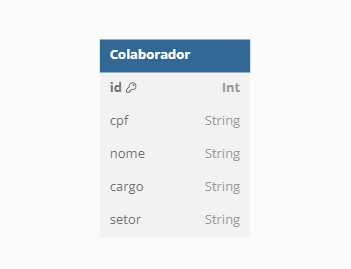

# Digiboard - Teste

## Instruções para Executar o App

1. Acesse a pasta `digiboard-back`, instale as dependências com `npm install` e execute o servidor localmente com `node server.js`. Isso abrirá a porta 3000.
2. Acesse a pasta `digiboard-front`, instale as dependências com `npm install` e execute o front-end localmente com `ng serve`. Após isso, acesse a porta <http://localhost:4200/>.
3. Digite a senha: "1234" para acessar o sistema.

## Checks

- [x] Colaboradores podem ser listados por setor e cargo, no select.
- [x] Colaboradores podem ser adicionados, deletados e editados.
- [x] Token de sessão expira em 30 minutos.
- [x] Diagrama de entidade-relacionamento disponível ao final deste README.
- [x] Front-end em Angular, back-end com Express e banco de dados PostgreSQL (ORM Prisma).

---

## Front-End da Digiboard

- Angular
- Angular Material
- TailwindCSS
- npm

## Back-End da Digiboard

A base de dados PostgreSQL está armazenada online, no serviço de back-end FL0 (https://app.fl0.com/junowoz/digiboard-back/dev/digiboard).

- Node.js
- ORM Prisma
- PostgreSQL
- Express
- Dependências: cors, jsonwebtoken
- npm

---

## Diagrama de Entidade-Relacionamento

Há apenas uma tabela, portanto, é algo simples. Diagrama realizado com [dbdiagram](https://dbdiagram.io).

